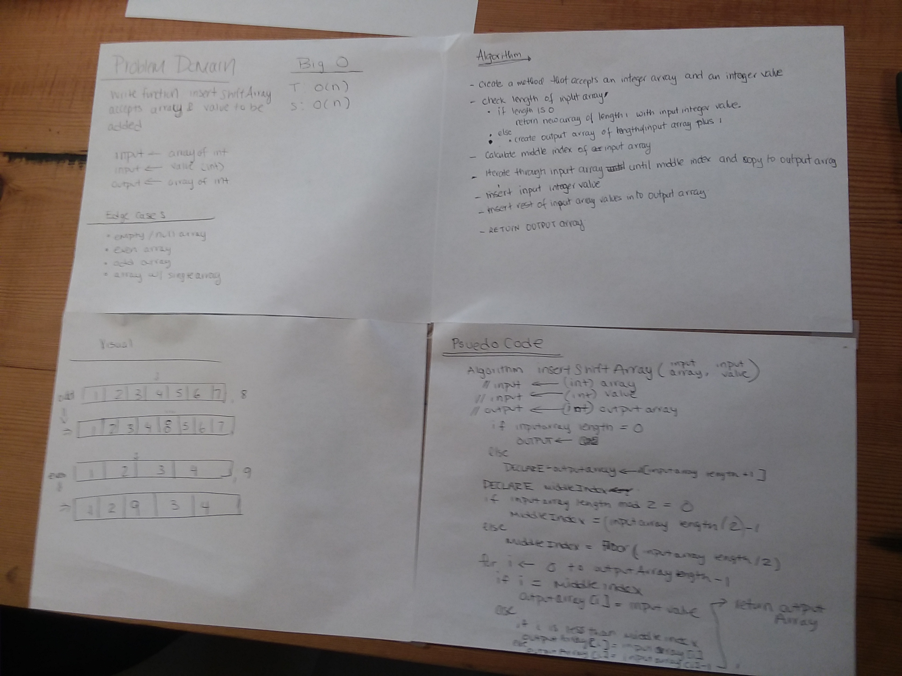
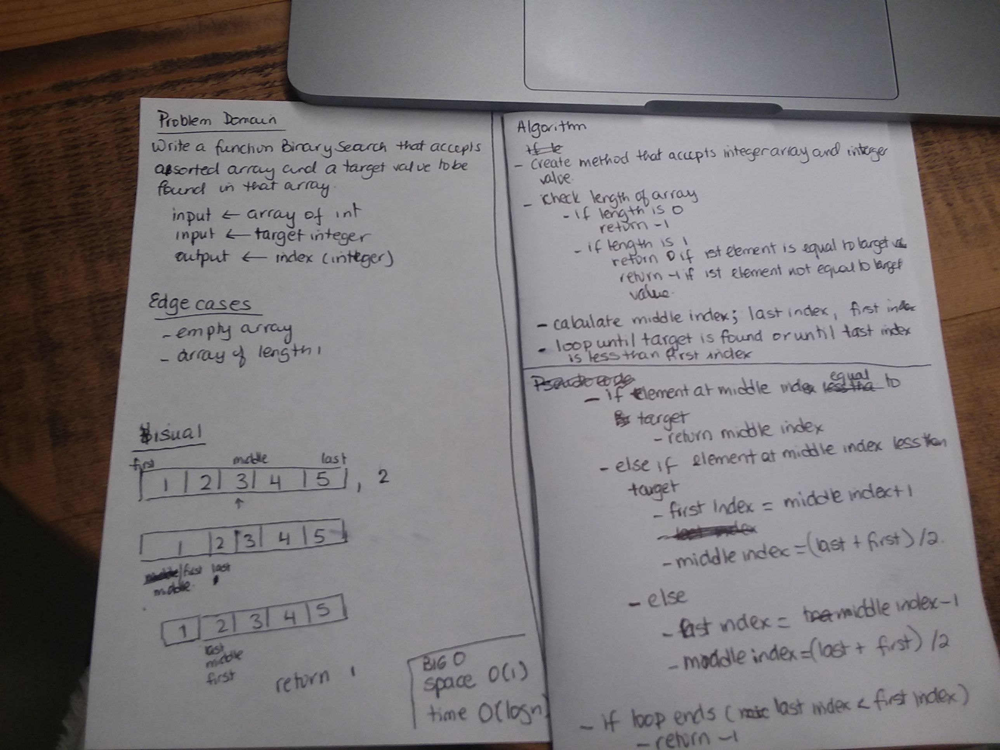
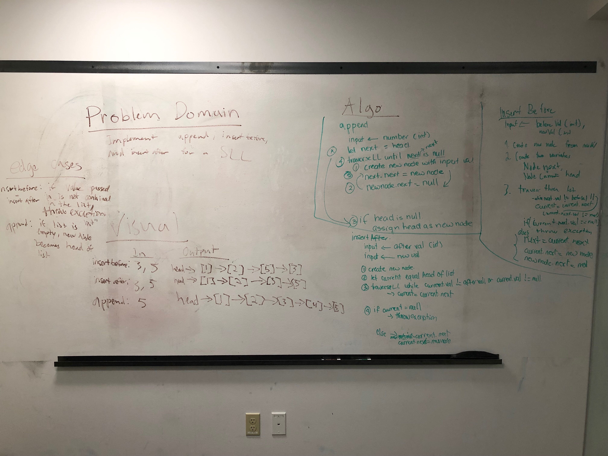
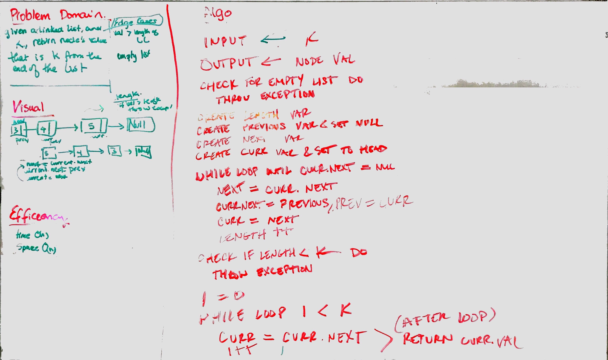
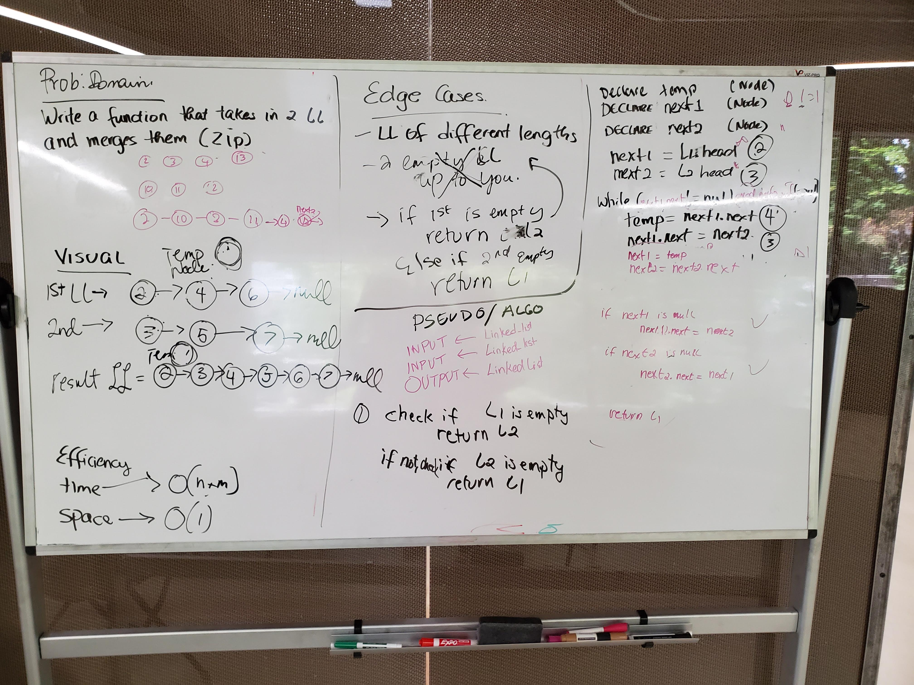
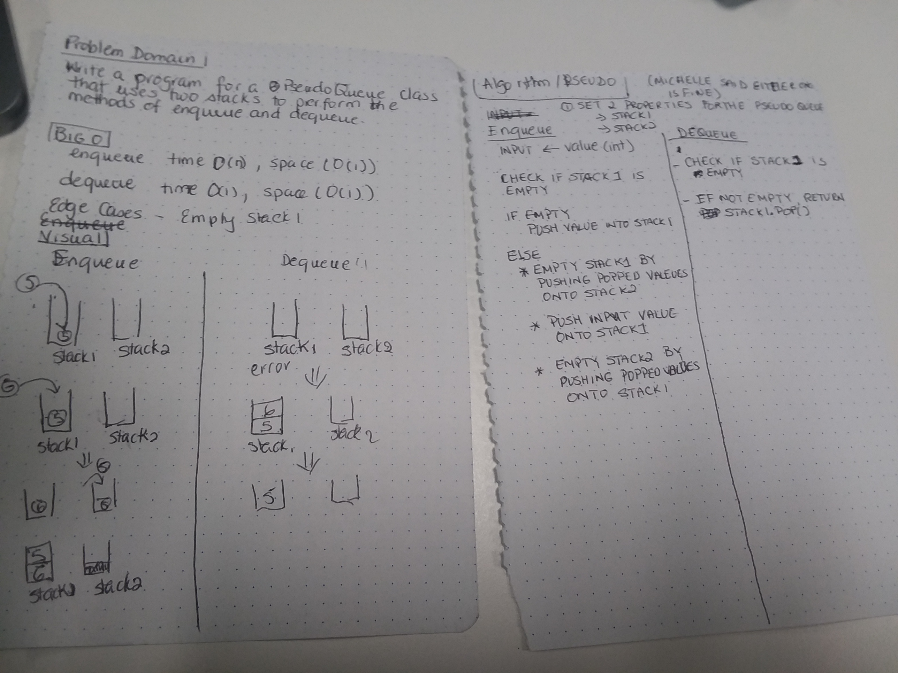
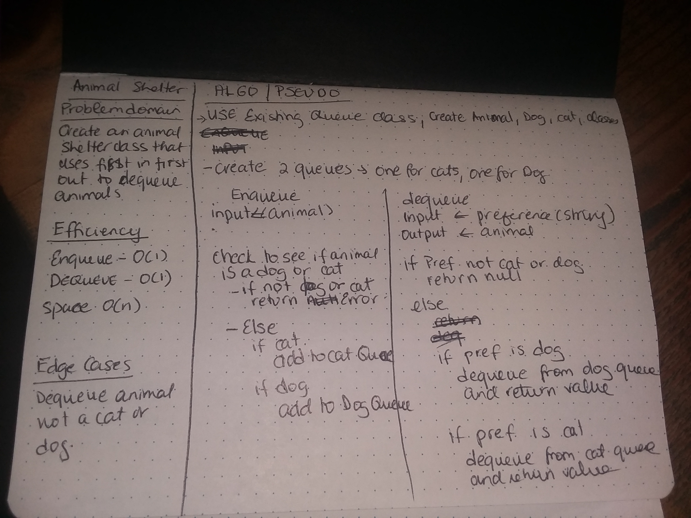
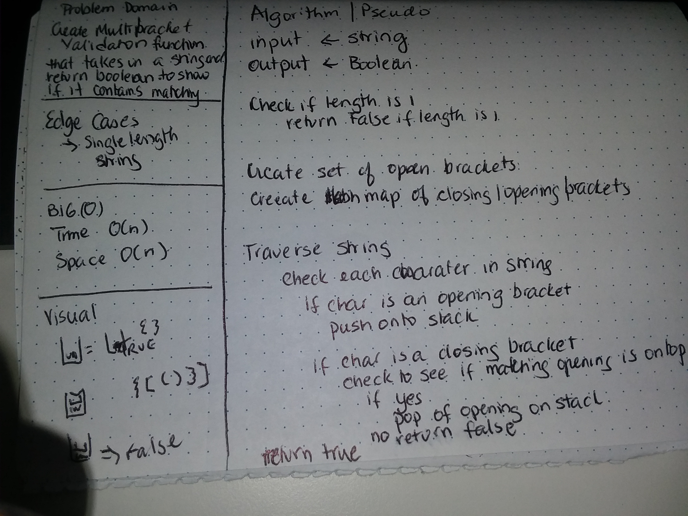

## ArrayShift Challenge

Given an array and a value, insert the value in the middle of the array. 

### Approach & Efficiency
I approached it by copying the contents to a new (output) array one at a time until the position for the value to be inserted into the output array. Once the value to be inserted was added, I continued adding the rest of the elements of the input array to the output array.

### Solution
[Code](../src/main/java/java401codechallenges/ArrayShift.java)

## Binary search Challenge

Given an array and a value, determine if the value is found in the array. 

### Approach & Efficiency
I approached this by dividing the array in half, and checking to see if the target value can be found at the middle value each time and the index of that element of the array would be returned. If the middle value is more than the target value, the first half the the sub array if checked, otherwise the last half is checked for the target value. If the target value is not found, then -1 will be returned.

### Solution
[Code](../src/main/java/java401codechallenges/BinarySearch.java)

## Singly Linked List
Create a LinkedList data structure that has a head property, and insert, includes and print methods

## Approach & Efficiency
- I first created a Node class that hold 2 properties value, and next node
- For the linkedList class, the head property is a node

## API
<!-- Description of each method publicly available to your Linked List -->
- insert method - A new node with the input value was created, I then removed the head reference to the original head in the linked list, and made the next node of the new doe the original head. Then the new node was made the head
- includes method - the entire linked list was traversed to search for the value to be found. If the value of the current node is the same as the search value, true was return, If not the next node in the linked lst was then checked. False is return id the value if not found in any of the nodes
- print method -  returns an array list of all the values in the linked list. The entire linked list was traversed, adding each current value to the arraylist.
### Solution
[Code](https://github.com/tgreenidge/data-structures-and-algorithms/blob/master/java401codechallenges/src/main/java/java401codechallenges/LinkedList.java)

## Linked Lists insertion Challenge

Create append, insertBefore and insertAfter methods for the linked list. 

### Approach & Efficiency
Efficiency -  for all 3 methods, the Big O is O(n)

**Append** - traverse list to the second to last node, updating current node each time. Insert new node before the null node

**Insert Before** - traverse list until the node before the node with the input before val (or to end of list if before val not in list), updating current node each time. Insert the new node before the node with the before val, if before val not in list, throw exception.

**Insert After** - traverse list until the node with the input after val (or to end of list if after val not in list), updating current node each time. Insert the new node after the node with the after val, if after val not in list, throw exception.

### Solution
[Code](https://github.com/tgreenidge/data-structures-and-algorithms/blob/master/java401codechallenges/src/main/java/java401codechallenges/LinkedList.java)

## Linked Lists Kth value from the end Challenge

Create KthValueFrom end method that outputs the kth value from the end of the list

### Approach & Efficiency
Approach - Traversed linked list to create new linked list that is the reverse of the linked list. Created a new list so that the list itself is not modified. Once the reversed list is created, traverse the reverse list from 0 to kth value. 

Efficiency -  For both time and space, the complextiy Big O is O(n)

### Solution
[Code](https://github.com/tgreenidge/data-structures-and-algorithms/blob/master/java401codechallenges/src/main/java/java401codechallenges/LinkedList.java)

## Linked Lists merge 2 linked lists Challenge

Create merge method takes in 2 linked lists and returns the 2 list merged (zipped into one list)

### Approach & Efficiency
Approach - traverse each linked list. Point the next node of current node in list1 to next node in list2, and vici versa

Efficiency -  Time -  Big O(n + m), where n = length of 1st LL, and m is length of 2nd LL
              Space - Big (1);

### Solution
[Code](https://github.com/tgreenidge/data-structures-and-algorithms/blob/master/java401codechallenges/src/main/java/java401codechallenges/LinkedList.java)

## Stacks
Create a Stack data structure that has a top property, and pop, push and peek methods

## Approach & Efficiency
- All methods have O(1) time and space complexity

## API
- push method - A new node with the input value was created, I then removed the top reference to the original top in the stack, and made the next node of the new node the original top. Then the new node was made the yop
- pop method - If top is null, null pointer exception thrown, otherwise, top is removed, and it's next node is now the top
- peek method -  returns the top value fo the stack
### Solution
[Code](https://github.com/tgreenidge/data-structures-and-algorithms/blob/master/java401codechallenges/src/main/java/java401codechallenges/Stack.java)

## Queues
Create a Queue data structure that has a front and back properties, and enqueue, dequeue and peek methods

## Approach & Efficiency
- All methods have O(1) time and space complexity

## API
- enqueue method - if front is null, front and back points to new node created with value input. Otherwise, the next node of the back pointer is set to the new node that is created with the input va;ue
- dequeue method - The front is set to the original front's next node. The original front's value is returned
- peek method -  returns the front value fo the queue
### Solution
[Code](https://github.com/tgreenidge/data-structures-and-algorithms/blob/master/java401codechallenges/src/main/java/java401codechallenges/Queue.java)

## PseudoQueues
Create a Queue data structure that has a front and back properties, and enqueue, dequeue and peek methods

## Approach & Efficiency
- Enqueue has O(n) time and space complexity
- Dequeue has O(1) time and space complexity

## API
- enqueue method - 2 stacks are used. For enqueue, empty stack1 into stack2, then push input value into stack1. Push all of stack2 onto stack1;
- dequeue method - The original top value  of stack1 is returned
### Solution
[Code](https://github.com/tgreenidge/data-structures-and-algorithms/blob/master/java401codechallenges/src/main/java/java401codechallenges/PseudoQueue.java)

## AnimalShelter
Create a Queue data structure that has a front and back properties, and enqueue, dequeue and peek methods

## Approach & Efficiency
- Enqueue has O(1) time and space complexity
- Dequeue has O(1) time and space complexity

- Created an animal class, an a dog class and cat class that both inherits from Animal.
- Created a Animal Shelter class that has 2 queues - a dog queue and a cat queue

## API
- enqueue method - if animal is a cat, cat is enqueued into the shelter's cat queue, if if animal is a dog, dog is enqueued into the shelter's dog queue
- dequeue method - If preference is cat, dequeue from cat queue, if preference is dog, dequeue from dog queue, if neither, return null
### Solution
[Code](https://github.com/tgreenidge/data-structures-and-algorithms/blob/master/java401codechallenges/src/main/java/java401codechallenges/AnimalShelter.java)

## MultibracketValidation
Create a function that takes in a string as its only argument, and should return a boolean representing whether or not the brackets in the string are balanced. There are 3 types of brackets:

         - Round Brackets : ()

         - Square Brackets : []

         - Curly Brackets : {}

## Approach & Efficiency
Time O(n);
Space O(n);

Traverse string and Push opening brackets onto a stack, when a closing bracket is encountered in string, and the closing bracket pairs up with the opening bracket, pop the opening bracket off the stack.
Once a closing bracket does not pair with an opening bracket, return false. Ignore all other characters found in string.

[Code](https://github.com/tgreenidge/data-structures-and-algorithms/blob/master/java401codechallenges/src/main/java/java401codechallenges/MultibracketValidation.java)

## TreeNode
create a class that contains a root property, a left treenode property, and a right tree node property

[Code](https://github.com/tgreenidge/data-structures-and-algorithms/blob/master/java401codechallenges/src/main/java/java401codechallenges/TreeNode.java)

## BinaryTree
Create a class with 3 traversals - preorder, inorder and postorder, and return arrays with values for each function

## Approach & Efficiency
Time O(n) for all 3
Space O(1) for all 3;

- preOrder - process the root value first (add it's value to the array list), then process the left node, then process the right node
- inOrder - process the left node value first (add it's value to the array list), then process the root node, then process the right node
- postOrder - process the left value first (add it's value to the array list), then process the right node, then process the root node

[Code](https://github.com/tgreenidge/data-structures-and-algorithms/blob/master/java401codechallenges/src/main/java/java401codechallenges/BinaryTree.java)

## BinarySearchTree
Create a Binary Search tree class with 2 methods - contains and add

## Approach & Efficiency
Time O(n); for both methods
Space O(1); for both methods

- add - checks the root to see if the value is less than or more than the target. If less than, add to left tree, else add to right of the tree
- contains - uses recursion to search for value in the tree. On each iteration of recursion, checks the root to see if the value is less than or more than the target. If less than, search right of tree, else search right of the tree

[Code](https://github.com/tgreenidge/data-structures-and-algorithms/blob/master/java401codechallenges/src/main/java/java401codechallenges/BinarySearchTree.java)
